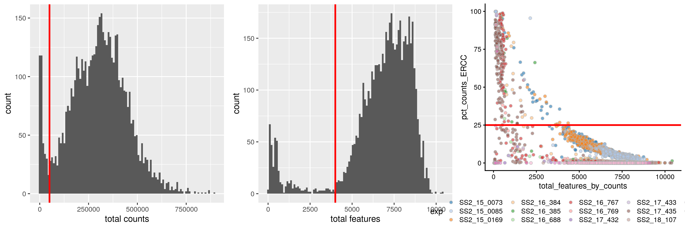
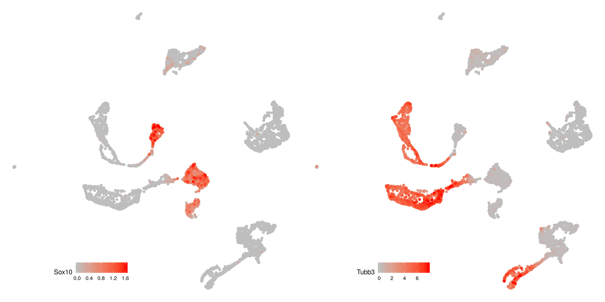
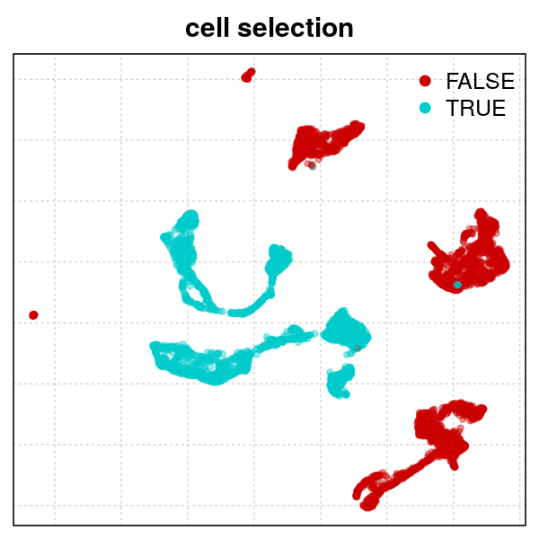
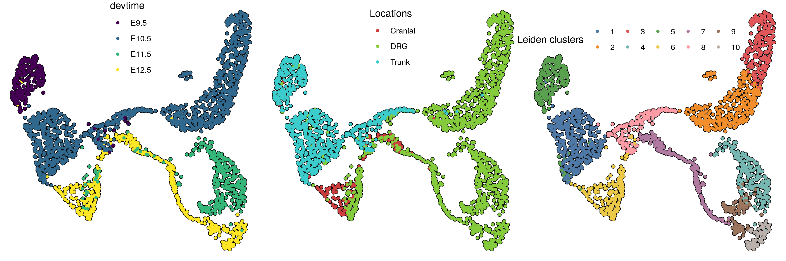
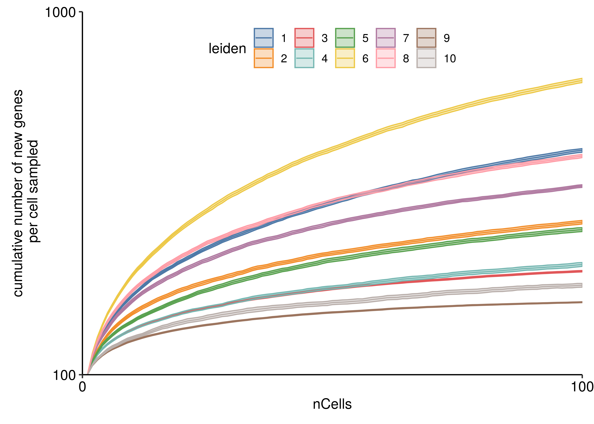
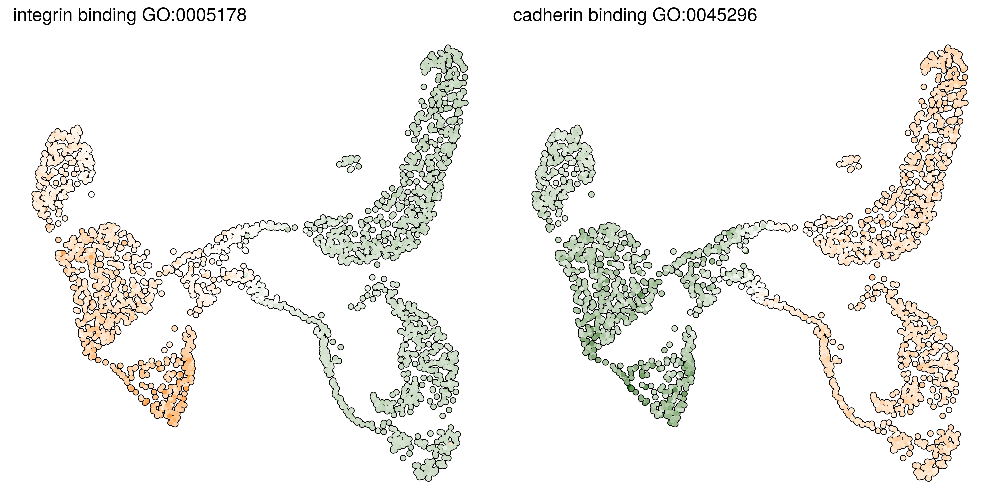
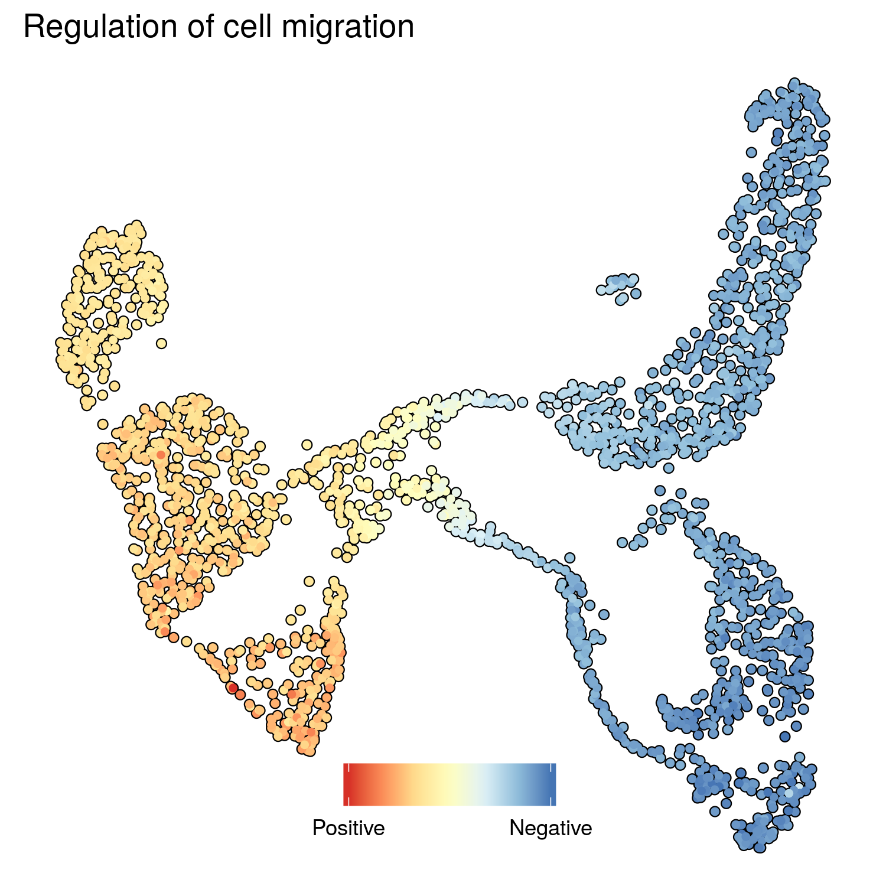

Preprocessing
================

-   [Importing functions and data](#importing-functions-and-data)
    -   [Initialize SCE object](#initialize-sce-object)
-   [QC](#qc)
    -   [Calculate QC netrics and filter cells](#calculate-qc-netrics-and-filter-cells)
    -   [Create filtered expression object](#create-filtered-expression-object)
-   [Overview of the dataset](#overview-of-the-dataset)
-   [Sensory lineages analysis](#sensory-lineages-analysis)
    -   [Clustering, and pathway overdispersion analysis](#clustering-and-pathway-overdispersion-analysis)
    -   [Main UMAP plots](#main-umap-plots)
    -   [Heterogeneity](#heterogeneity)
    -   [GO term plots](#go-term-plots)

This notebook describe the full processing pipeline for filtering the datasets and obtaining a pagoda2

Importing functions and data
============================

``` r
library(SingleCellExperiment)
library(scater)
library(grid)
library(egg)
library(reticulate)
library(pagoda2)
library(Seurat)
library(ggplot2)
library(parallel)

source("helpers/preprocessing.R")


cnts=as.matrix(read.csv("_Output/raw_counts.csv",row.names = 1,check.names=FALSE))
```

Initialize SCE object
---------------------

``` r
timeloc=c("Cranial12.5","Cranial12.5",
  "DRG10.5","DRG10.5","DRG10.5","DRG10.5",
  "DRG11.5",
  "DRG12.5",
  "DRG9.5","DRG9.5",
  "Trunk10.5","Trunk10.5","Trunk10.5",
  "Trunk9.5")
names(timeloc)=c("SS2_15_0073","SS2_15_0169",
  "SS2_16_688","SS2_16_769","SS2_17_432","SS2_17_433",
  "SS2_16_385",
  "SS2_16_384",
  "SS2_16_767","SS2_17_435",
  "SS2_18_107","SS2_18_108","SS2_18_109",
  "SS2_15_0085")

plates=sapply(strsplit(colnames(cnts),":"),"[[",1)
timepoints=plates
for (i in 1:length(timeloc)){timepoints[timepoints%in%names(timeloc)[i]]=timeloc[i]}
time=as.numeric(stringr::str_extract(timepoints, "\\-*\\d+\\.*\\d*"))

anno = cbind(colnames(cnts),
             plates,
             timepoints,
             time)
colnames(anno) <- c("cell","exp","timepoints","time")

reads <- SingleCellExperiment(
  assays = list(counts = cnts),
  colData = anno
)
```

QC
==

Calculate QC netrics and filter cells
-------------------------------------

``` r
reads <- calculateQCMetrics(reads, feature_controls = list(ERCC = grep("ERCC",rownames(cnts))))

reads = reads[,reads$total_features_by_counts!=0]

q1=ggplot() + 
  geom_histogram(aes(reads$total_counts),bins = 100) + 
  geom_vline(xintercept = 0.5e5, color = "red", size=1) +
  xlab("total counts")

filter_by_total_counts <- (reads$total_counts > 0.5e5)

q2 = ggplot() + 
  geom_histogram(aes(reads$total_features_by_counts),bins = 100) + 
  geom_vline(xintercept = 4000, color = "red", size=1) +
  xlab("total features")

filter_by_expr_features <- (reads$total_features_by_counts > 4000)

q3 = plotColData(reads,x="total_features_by_counts",y="pct_counts_ERCC", colour_by = "exp") + 
  geom_hline(yintercept = 25, color = "red", size=1) +theme(legend.position = "bottom")

filter_by_ERCC <- reads$pct_counts_ERCC < 25

reads$use <- (
  # sufficient features (genes)
  filter_by_expr_features &
    # sufficient molecules counted
    filter_by_total_counts &
    # sufficient endogenous RNA
    filter_by_ERCC
)

ggsave("figures/QC.png",cowplot::plot_grid(q1,q2,q3,nrow = 1),width = 12,height = 4)
```



Create filtered expression object
---------------------------------

``` r
reads.filtered = reads[-(grep("ERCC",rownames(cnts))),reads$use]

# this is going to be used for velocity calculation
cells.out.of.QC = colnames(reads)[!reads$use]

tps=as.character(reads.filtered$timepoints)

reads.filtered$timepoints=factor(gsub("-","",gsub("[.]","",gsub("\\d", "", tps))))

names(reads.filtered$timepoints)=colnames(reads.filtered)
names(reads.filtered$time)=colnames(reads.filtered)
names(reads.filtered$exp)=colnames(reads.filtered)

saveRDS(reads.filtered,"submission/reads.filtered.rds")
```

Overview of the dataset
=======================

``` r
reads.filtered=readRDS("submission/reads.filtered.rds")
library(Seurat)
p2=p2.wrapper(counts(reads.filtered))
```

``` r
emb2=data.frame(p2$embeddings$PCA$UMAP)
emb2$gene=p2$counts[,"Sox10"]
emb2=emb2[order(emb2$gene,decreasing = F),]
gn1=ggplot(emb2)+geom_point(aes(x=UMAP1,y=UMAP2,col=gene))+
      scale_color_gradient(name="Sox10",low = "grey",high="red")+theme_void()+
      theme(aspect.ratio = 1,legend.direction = "horizontal",legend.position = c(.3,.1))

emb2=data.frame(p2$embeddings$PCA$UMAP)
emb2$gene=p2$counts[,"Tubb3"]
emb2=emb2[order(emb2$gene,decreasing = F),]
gn2=ggplot(emb2)+geom_point(aes(x=UMAP1,y=UMAP2,col=gene))+
      scale_color_gradient(name="Tubb3",low = "grey",high="red")+theme_void()+
      theme(aspect.ratio = 1,legend.direction = "horizontal",legend.position = c(.3,.1))

ggsave("figures/overview_Sox10_Tubb3.png",cowplot::plot_grid(gn1,gn2),width = 14,height = 7)
```



``` r
sel=p2$clusters$PCA$leiden%in%c(6,8,9,10,3,5)
names(sel)=rownames(p2$counts)
select=rownames(p2$counts)[p2$clusters$PCA$leiden%in%c(2,3,7,10,12)]
png("figures/cell_selection.png",width = 4,height = 4,units = "in",res=150)
p2$plotEmbedding("PCA","UMAP",groups=sel,show.legend = T)
title("cell selection")
dev.off()
```



Sensory lineages analysis
=========================

Clustering, and pathway overdispersion analysis
-----------------------------------------------

``` r
p2_sensory=p2.wrapper(counts(reads.filtered[,select]),n_neighbors = 80,min_dist = .5)

p2_sensory$n.cores=10
go.env <- p2.generate.mouse.go(p2_sensory)
p2_sensory$testPathwayOverdispersion(setenv = go.env,
                             recalculate.pca=F,
                             correlation.distance.threshold = 0.95)
myGeneNames <- colnames(p2_sensory$counts)
goSets <- p2.generate.mouse.go.web(myGeneNames)
deSets <- get.de.geneset(p2_sensory, groups = p2_sensory$clusters$PCA$leiden, prefix = 'de_')
geneSets <- c(goSets, deSets)
```

### Regressing out respiratory chain

``` r
s=CreateSeuratObject(counts(reads.filtered[,rownames(p2_sensory$counts)]))
s=NormalizeData(s)
s@meta.data$mito=p2_sensory$misc$pathwayOD$xv[5,]
s=ScaleData(s,vars.to.regress = "mito",do.par = T,num.cores = 4)
s=FindVariableGenes(s);s=RunPCA(s,pcs.compute = 100)
x <- cbind(1:100, s@dr$pca@sdev)
line <- x[c(1, nrow(x)),]
proj <- princurve::project_to_curve(x, line)
optpoint <- which.max(proj$dist_ind)-1

ggplot()+geom_point(aes(x=u[,1],y=u[,2],col=reads.filtered[,rownames(u)]$time))

p2_sensory$embeddings$PCA$UMAP=doUMAP(GetCellEmbeddings(s)[,1:8],n_neighbors = 100,min_dist = .5)

Pal=doPalantir(GetCellEmbeddings(s)[,1:8],n_neighbors = 100,min_dist = .5)

#write.csv(GetCellEmbeddings(s,"umap"),"_py_Velocity/umap_early+late_3D.csv")
write.csv(p2_sensory$embeddings$PCA$UMAP,"velocity/umap_sensory.csv")
write.csv(as.numeric(p2_sensory$clusters$PCA$leiden),"velocity/clusters_sensory.csv",row.names = F)

p2_sensory$reductions$PCA=GetCellEmbeddings(s,"pca")
p2_sensory$makeKnnGraph(k=40,type='PCA',center=T,distance='cosine');
p2_sensory$getKnnClusters(method=conos::leiden.community,type='PCA',name = "leiden",resolution=.6)
```

### Making pagoda2 web app

``` r
additionalMetadata$leiden <- p2.metadata.from.factor(p2_sensory$clusters$PCA$leiden, displayname = 'Leiden', s = 0.7, v = 0.8,start = 0, end = 0.5,pal = ggthemes::tableau_color_pal(palette = "Tableau 10")(nlevels(p2_sensory$clusters$PCA$leiden)))

library(ggthemes)
additionalMetadata <- list()

additionalMetadata$leiden <- p2.metadata.from.factor(p2_sensory$clusters$PCA$leiden, displayname = 'Leiden', s = 0.7, v = 0.8,start = 0, end = 0.5,pal = tableau_color_pal(palette = "Tableau 20")(nlevels(p2_sensory$clusters$PCA$leiden)))

expcells = reads.filtered[,names(p2_sensory$clusters$PCA[[1]])]$exp
names(expcells) = names(p2_sensory$clusters$PCA[[1]])
additionalMetadata$exp <- p2.metadata.from.factor(expcells, 
                                                  displayname = 'Batch', 
                                                  s = 0.7, 
                                                  v = 0.8,
                                                  start = 0, 
                                                  end = 0.5,
                                                  pal = palette_pander(nlevels(expcells)))

tpcells = reads.filtered[,names(p2_sensory$clusters$PCA[[1]])]$timepoints
names(tpcells) = names(p2_sensory$clusters$PCA[[1]])
additionalMetadata$tp <- p2.metadata.from.factor(tpcells, 
                                                 displayname = 'Location', 
                                                 s = 0.7, 
                                                 v = 0.8,
                                                 start = 0, 
                                                 end = 0.5)

time = reads.filtered[,names(p2_sensory$clusters$PCA[[1]])]$time
names(time) = names(p2_sensory$clusters$PCA[[1]])


p2w <- make.p2.app(
  p2_sensory,
  dendrogramCellGroups = p2_sensory$clusters$PCA$leiden,
  additionalMetadata = additionalMetadata,
  geneSets = geneSets,
  show.clusters = FALSE # Hide the clusters that were used for the dendrogram from the metadata
)
#show.app(p2w,"p2")

saveRDS(p2w,"submission/p2w_sensory.rds")
p2w$serializeToStaticFast("submission/p2w_sensory.bin")
```

Main UMAP plots
---------------

``` r
tm=timplot(p2_sensory$embeddings$PCA$UMAP,p2w=p2w,reverse = T)+scale_color_viridis_d(labels=c("E9.5","E10.5","E11.5","E12.5"))+theme(legend.position = c(.5,.85))

loc=locplot(p2w$originalP2object$embeddings$PCA$UMAP,p2w,reads.filtered,pos = c(.5,.85))

clu=cluplot(p2_sensory$embeddings$PCA$UMAP,p2_sensory,p2w,pos = c(.4,.85))+theme(legend.direction = "horizontal")

ggsave("figures/main_umap_plots.png",cowplot::plot_grid(tm,loc,clu,nrow = 1),width = 12,height = 4)
```



Heterogeneity
-------------

``` r
res=list()
for (clu in 1:10){
  cat(paste0("doing cluster ",clu,"\n"))
  cumnew=mclapply(1:100,function (x){
    topgenes=c();allgenes=c()
    cellnames=names(p2_sensory$clusters$PCA$leiden)[p2_sensory$clusters$PCA$leiden%in%clu]
    sel=sample(cellnames,100,replace = T)
    for (i in 1:100){
      topgenes=unique(c(topgenes,names(p2_sensory$counts[sel[i],order(p2_sensory$counts[sel[i],],decreasing = T)])[1:100]))
      allgenes[i]=length(topgenes)
    }
    return(allgenes)
  },mc.cores = 40)
  res[[clu]]=do.call(rbind,lapply(1:100,function(x) data.frame(rep=x,val=cumnew[[x]],cum=1:100)))
  res[[clu]]$cluster=clu
}

cumres=do.call(rbind,res)
cumres$leiden=factor(cumres$cluster)
cumplot=ggplot(cumres,aes(cum,val,fill=leiden,col=leiden))+ stat_summary(geom = "line", fun.y = mean)+
    stat_summary(geom = "ribbon", fun.data = mean_cl_boot, alpha = 0.3,fun.args=list(conf.int=.9))+
    scale_color_tableau("Tableau 10")+scale_fill_tableau("Tableau 10")+theme_pubr()+
    ylab("cumulative number of new genes\n per cell sampled")+xlab("nCells")+scale_x_continuous(expand = c(0,0),limits=c(0,100),breaks = c(0,100))+scale_y_continuous(limits=c(100,1000),expand = c(0,0),breaks = c(100,1000))+
  theme(legend.direction = "horizontal",legend.position = c(.5,.9),plot.margin = margin(10, 10, 10, 10, "pt"))

ggsave("_Figures/cumplot.png",cumplot,height = 5,width = 7,dpi = 600)
```



GO term plots
-------------

### Cell adhesion

``` r
pl_int=ggplot(data.frame(umap))+geom_point(aes(x=UMAP1,y=UMAP2),size=1.5,color="black")+
  geom_point(aes(x=UMAP1,y=UMAP2,col=t(p2_sensory$misc$pwpca$`GO:0005178`$xp$scores)),size=1)+
  theme_void()+theme(aspect.ratio = 1,legend.position="none")+scale_color_gradient2(low = "darkgreen", mid="white", high="darkorange")+
  ggtitle("integrin binding GO:0005178")

pl_cad=ggplot(data.frame(umap))+geom_point(aes(x=UMAP1,y=UMAP2),size=1.5,color="black")+
  geom_point(aes(x=UMAP1,y=UMAP2,col=t(p2_sensory$misc$pwpca$`GO:0045296`$xp$scores)),size=1)+
  theme_void()+theme(aspect.ratio = 1,legend.position="none")+scale_color_gradient2(low = "darkgreen", mid="white", high="darkorange")+
  ggtitle("cadherin binding GO:0045296")

pl_adh=arrangeGrob(pl_int,pl_cad,nrow=1)

ggsave("figures/adhesion.png",pl_adh,width = 10,height = 5,dpi = 600)
```



### Migration

``` r
transition=t(p2_sensory$misc$pwpca$`GO:0030335`$xp$scores)-t(p2_sensory$misc$pwpca$`GO:0030336`$xp$scores)


pl_mig=ggplot(data.frame(emb))+geom_point(aes(x=UMAP1,y=UMAP2),size=1.5,color="black")+
  geom_point(aes(x=UMAP1,y=UMAP2,col=transition),size=1)+theme_void()+theme(aspect.ratio = 1,legend.position=c(0.5,.1),legend.direction = "horizontal")+ guides(colour = guide_colorbar(reverse=T))+scale_color_distiller(palette = "RdYlBu",name="",breaks=c(min(transition),max(transition)),labels=c("Negative","Positive"))+ggtitle("Regulation of cell migration")

ggsave("figures/migration.png",pl_mig,width = 5,height = 5,dpi = 300)
```


