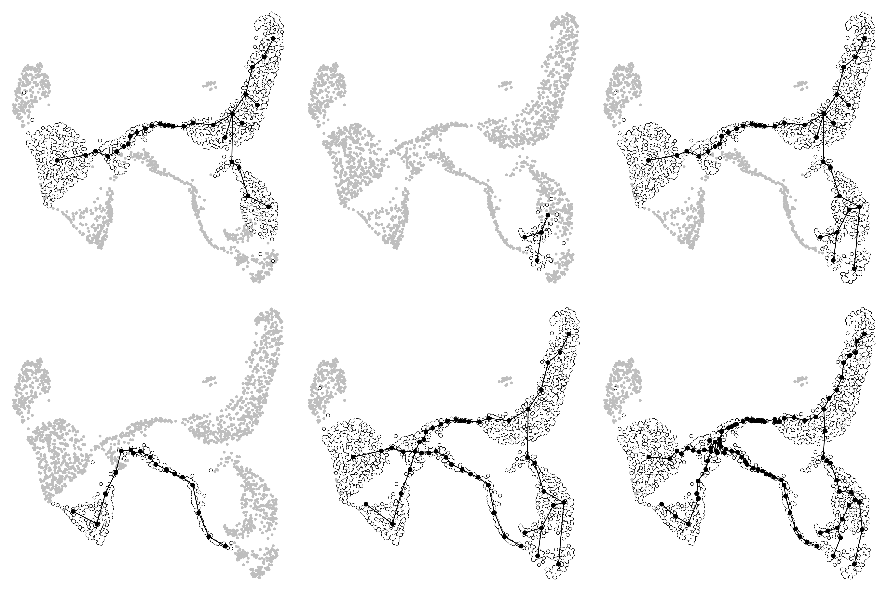
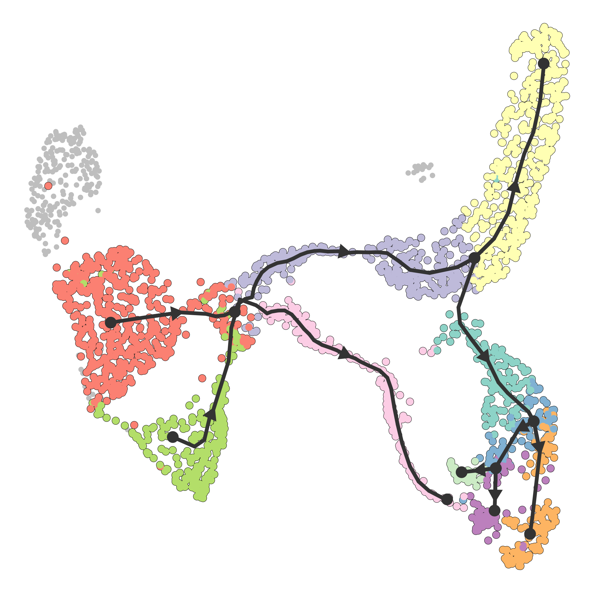

```{r setup, include = FALSE}
knitr::opts_chunk$set(eval = FALSE)
```


```{r}
library(ElPiGraph.R)
library(rdist)
library(crestree)
library(pbapply)

source("helpers/pseudotime.R")
```

# Elpigraph

```{r get data}
#p2w <- readRDS("p2w_sensory.rds")
p2_sensory=p2w$originalP2object
Pal <- readRDS("data/Palantir.rds")
umap=p2_sensory$embeddings$PCA$UMAP
colnames(umap)=c("UMAP1","UMAP2")

umap1=umap[!(p2_sensory$clusters$PCA$leiden)%in%c(5,9,10,6,7) & !(p2_sensory$clusters$PCA$infomap==23),]

dims=5

X=Pal$ms_data[rownames(umap1),1:dims]
```

## Semi-supervised pseudotime tree inference

```{r not}
Tr=computeElasticPrincipalTree(X,NumNodes = 30)
N=Tr[[1]]$NodePositions;E=Tr[[1]]$Edges$Edges

pl1=plot.graph.fates.to.umap(X,N,E,umap)

X2=Pal$ms_data[(p2_sensory$clusters$PCA$leiden)%in%9,1:dims]
Tree2=computeElasticPrincipalTree(X2,NumNodes = 4,
                                drawAccuracyComplexity = F,
                                drawPCAView = F,drawEnergy = F,Do_PCA = F)

pl2=plot.graph.fates.to.umap(X2,Tree2[[1]]$NodePositions,Tree2[[1]]$Edges$Edges,umap)

tips=degree(ConstructGraph(Tree2[[1]]))==1
k1=which(cdist(N,Tree2[[1]]$NodePositions[tips,])==min(cdist(N,Tree2[[1]]$NodePositions[tips,])),arr.ind = T)
k1[2]=which(tips)[k1[2]]
center=t(as.matrix(colMeans(Pal$ms_data[(p2_sensory$clusters$PCA$leiden)%in%10,1:dims])))
k2=which.min(cdist(center,N))

E=rbind(E,Tree2[[1]]$Edges$Edges+nrow(N),c(k1[1],k1[2]+nrow(N)))
N=rbind(N,Tree2[[1]]$NodePositions,center)
E=rbind(E,c(k2,nrow(N)))

X_f=Pal$ms_data[!(p2_sensory$clusters$PCA$leiden)%in%c(5,6,7) & !(p2_sensory$clusters$PCA$infomap==23),1:dims]
pl3=plot.graph.fates.to.umap(X_f,N,E,umap)

X_l=Pal$ms_data[(p2_sensory$clusters$PCA$leiden)%in%c(6,7),1:dims]
Curve=computeElasticPrincipalCurve(X_l,NumNodes = 15)
Curve[[1]]=ExtendLeaves(X_l,Curve[[1]])


N1=N;E1=E
N2=Curve[[1]]$NodePositions
E2=Curve[[1]]$Edges$Edges

pl4=plot.graph.fates.to.umap(X_l,N2,E2,umap)

k=which(cdist(N1,N2)==min(cdist(N1,N2)),arr.ind = T)
newpoint=colMeans(rbind(N1[k[1],],N2[k[2],]))
N1[k[1],]=newpoint
E=rbind(E1,E2+nrow(N1),
        c(k[1],neighbors(ConstructGraph(Curve[[1]]),3)[1]+nrow(N1)),
        c(k[1],neighbors(ConstructGraph(Curve[[1]]),3)[2]+nrow(N1)))
N=rbind(N1,N2)
f=remove.nodes(NodePositions = N,Edges = E,Nodes = nrow(N1)+k[2])
N=f[[1]];E=f[[2]]

X_a=rbind(X_f,X_l)

cleaned=remove.nodes(N,E,c(10,6,29))
N=cleaned[[1]];E=cleaned[[2]]
pl5=plot.graph.fates.to.umap(X_a,N,E,umap)


NodePositions=N
Edges=E


for (i in 1:1){
  nE=c()
  for (e in 1:nrow(Edges)){
    NodePositions=rbind(NodePositions,colMeans(NodePositions[Edges[e,],]))
    nE=rbind(nE,
           c(Edges[e,1],nrow(NodePositions)),
           c(nrow(NodePositions),Edges[e,2]))
  }
  Edges=nE
}


pl6=plot.graph.fates.to.umap(X_a,NodePositions,Edges,umap)

ggsave("figures/elpigraph.png",cowplot::plot_grid(pl1,pl2,pl3,pl4,pl5,pl6),width = 15,height = 8)
```

```{r, eval = TRUE, echo=FALSE}

```

## Saving elpigraph tree as crestree ppt object

```{r}
z_el=graph.to.ppt(NodePositions,Edges,X_a,umap)
plotppt(z_el,umap,tips=T)
z_el=set2roots(z_el,roots = c(2,47))

ppt=project.cells.onto.ppt(z_el,umap)
```


# Crestree analysis


```{r pseudotime}
oldcol=ppt$pp.segments$color
#newcol=ggthemes::stata_pal("s2color")(15)[1:10]
newcol=RColorBrewer::brewer.pal(length(ppt$pp.segments$color)+2,"Set3")[-9]
names(newcol)=oldcol

for (c in oldcol){
  ppt$cell.summary$color[ppt$cell.summary$color==c]=newcol[c]
  ppt$cell.info[[1]]$color[ppt$cell.info[[1]]$color==c]=newcol[c]
  ppt$pp.segments$color[ppt$pp.segments$color==c]=newcol[c]
  ppt$pp.info$color[ppt$pp.info$color==c]=newcol[c]
}


res <- readRDS("~/R/SensoryFates/_Output/res_early_late.rds")
fpm <- log10(exp(scde::scde.expression.magnitude(res$knn, res$cd))+1)
ppt <- test.associated.genes(ppt,n.map=1,fpm,summary=TRUE,n.cores = 20,A.cut = 1)
ppt <- fit.associated.genes(ppt,fpm,n.map=1,n.cores = 20,gamma = 5)


png("_Figures/stat.association.png",width = 7,height = 7,units = "in",res = 600)
par(mfrow=c(1,1),mar=c(4.5,4.5,1,1))
plot(ppt$stat.association$A,ppt$stat.association$fdr,xlab="Amplitude",ylab="FDR, log",log="y",pch=19,cex=0.5,
     col=adjustcolor( ifelse(ppt$stat.association$sign==TRUE,"red","black") ,0.4),cex.lab=1.5)
legend("bottomleft", legend=c( paste("DE,",sum(ppt$stat.association$sign)), paste("non-DE,",sum(!ppt$stat.association$sign))),
       col=c("red", "black"), bty="n",pch=19,cex=1,pt.cex=1)
dev.off()


clusters=as.numeric(p2_sensory$clusters$PCA$leiden);names(clusters)=names(p2_sensory$clusters$PCA$leiden)
clusters[clusters==5]=0
clusters[rownames(ppt$cell.summary)]=ppt$cell.summary$seg

write.csv(clusters,"_py_Velocity/segments_early+late.csv",row.names = F)


zseg <- extract.subtree(ppt,c(2,4,29,28,32))
png("_Figures/e_markers.png",  width = 12, height = 8, units = 'in', res = 600)
par(mfrow=c(2,3))
for (g in c("Ntrk1","Ntrk2","Ntrk3","Runx3","Ret")){
  visualise.trajectory(ppt,g,fpm[g,],cex.main = 2,lwd.t2=0.5,subtree=zseg)
}
dev.off()

zseg <- extract.subtree(ppt,c(47,48))
png("_Figures/l_markers.png",  width = 12, height = 8, units = 'in', res = 600)
par(mfrow=c(2,3))
for (g in c("Ntrk1","Runx1","Runx3")){
  visualise.trajectory(ppt,g,fpm[g,],cex.main = 2,lwd.t2=0.5,subtree = zseg)
}
dev.off()

saveRDS(ppt,"_Output/ppt.rds")

dyn_el=ppt.to.dyno(ppt,umap[rownames(ppt$cell.summary),],X = X_a)
dyn_el$milestone_network[1,1:2]=dyn_el$milestone_network[1,c(2,1)]

saveRDS(dyn_el,"_Output/dyn_el.rds")

sz=1.5
pl_traj=plot_dimred(dyn_el,trajectory_projection_sd = .8,size_trajectory = sz)+theme(aspect.ratio = 1)+
  geom_point(data=data.frame(umap),aes(x=umap[,1],y=umap[,2]),color="grey")
pl_traj$layers[[5]]$geom_params$lineend="round"
pl_traj$layers[[4]]$aes_params$size=sz
pl_traj=gginnards::move_layers(pl_traj,idx = 7,position = "bottom")
pl_traj$data$color=ppt$cell.summary[pl_traj$data$cell_id,]$color

ggsave("_Figures/step3_trajectory_overview.png",pl_traj,width = 7,height = 7,dpi = 300)

```

```{r, eval = TRUE, echo=FALSE}

```
