Pseudotime\_analysis
================

-   [Principal gaph building using ElPiGraph](#principal-gaph-building-using-elpigraph)
    -   [Semi-supervised pseudotime tree inference](#semi-supervised-pseudotime-tree-inference)
    -   [Saving elpigraph tree as crestree ppt object](#saving-elpigraph-tree-as-crestree-ppt-object)
-   [Pseudotime and bifurcation analysis using crestree](#pseudotime-and-bifurcation-analysis-using-crestree)
    -   [Count matrix correction using scde](#count-matrix-correction-using-scde)
    -   [Finding and fitting genes associated with whole pseudotime tree](#finding-and-fitting-genes-associated-with-whole-pseudotime-tree)
    -   [Plotting known markers](#plotting-known-markers)
    -   [Neurogenic waves analysis](#neurogenic-waves-analysis)
    -   [TF Activity inference](#tf-activity-inference)
    -   [Bifurcation analysis](#bifurcation-analysis)

``` r
library(ElPiGraph.R)
library(rdist)
library(crestree)
library(pbapply)
library(dyno)
library(scde)
library(igraph)
library(parallel)
library(quadprog)
library(glmnet)
library(ggplot2)
library(mgcv)
library(grid)
library(gridExtra)
library(ggpubr)

source("helpers/pseudotime.R")
```

Principal gaph building using ElPiGraph
=======================================

``` r
#p2w <- readRDS("p2w_sensory.rds")
p2_sensory=p2w$originalP2object
Pal <- readRDS("data/Palantir.rds")
umap=p2_sensory$embeddings$PCA$UMAP
colnames(umap)=c("UMAP1","UMAP2")

umap1=umap[!(p2_sensory$clusters$PCA$leiden)%in%c(5,9,10,6,7) & !(p2_sensory$clusters$PCA$infomap==23),]

dims=5

X=Pal$ms_data[rownames(umap1),1:dims]
```

Semi-supervised pseudotime tree inference
-----------------------------------------

``` r
Tr=computeElasticPrincipalTree(X,NumNodes = 30)
N=Tr[[1]]$NodePositions;E=Tr[[1]]$Edges$Edges

pl1=plot.graph.fates.to.umap(X,N,E,umap)

X2=Pal$ms_data[(p2_sensory$clusters$PCA$leiden)%in%9,1:dims]
Tree2=computeElasticPrincipalTree(X2,NumNodes = 4,
                                drawAccuracyComplexity = F,
                                drawPCAView = F,drawEnergy = F,Do_PCA = F)

pl2=plot.graph.fates.to.umap(X2,Tree2[[1]]$NodePositions,Tree2[[1]]$Edges$Edges,umap)

tips=degree(ConstructGraph(Tree2[[1]]))==1
k1=which(cdist(N,Tree2[[1]]$NodePositions[tips,])==min(cdist(N,Tree2[[1]]$NodePositions[tips,])),arr.ind = T)
k1[2]=which(tips)[k1[2]]
center=t(as.matrix(colMeans(Pal$ms_data[(p2_sensory$clusters$PCA$leiden)%in%10,1:dims])))
k2=which.min(cdist(center,N))

E=rbind(E,Tree2[[1]]$Edges$Edges+nrow(N),c(k1[1],k1[2]+nrow(N)))
N=rbind(N,Tree2[[1]]$NodePositions,center)
E=rbind(E,c(k2,nrow(N)))

X_f=Pal$ms_data[!(p2_sensory$clusters$PCA$leiden)%in%c(5,6,7) & !(p2_sensory$clusters$PCA$infomap==23),1:dims]
pl3=plot.graph.fates.to.umap(X_f,N,E,umap)

X_l=Pal$ms_data[(p2_sensory$clusters$PCA$leiden)%in%c(6,7),1:dims]
Curve=computeElasticPrincipalCurve(X_l,NumNodes = 15)
Curve[[1]]=ExtendLeaves(X_l,Curve[[1]])


N1=N;E1=E
N2=Curve[[1]]$NodePositions
E2=Curve[[1]]$Edges$Edges

pl4=plot.graph.fates.to.umap(X_l,N2,E2,umap)

k=which(cdist(N1,N2)==min(cdist(N1,N2)),arr.ind = T)
newpoint=colMeans(rbind(N1[k[1],],N2[k[2],]))
N1[k[1],]=newpoint
E=rbind(E1,E2+nrow(N1),
        c(k[1],neighbors(ConstructGraph(Curve[[1]]),3)[1]+nrow(N1)),
        c(k[1],neighbors(ConstructGraph(Curve[[1]]),3)[2]+nrow(N1)))
N=rbind(N1,N2)
f=remove.nodes(NodePositions = N,Edges = E,Nodes = nrow(N1)+k[2])
N=f[[1]];E=f[[2]]

X_a=rbind(X_f,X_l)

cleaned=remove.nodes(N,E,c(10,6,29))
N=cleaned[[1]];E=cleaned[[2]]
pl5=plot.graph.fates.to.umap(X_a,N,E,umap)


NodePositions=N
Edges=E


for (i in 1:1){
  nE=c()
  for (e in 1:nrow(Edges)){
    NodePositions=rbind(NodePositions,colMeans(NodePositions[Edges[e,],]))
    nE=rbind(nE,
           c(Edges[e,1],nrow(NodePositions)),
           c(nrow(NodePositions),Edges[e,2]))
  }
  Edges=nE
}


pl6=plot.graph.fates.to.umap(X_a,NodePositions,Edges,umap)

ggsave("figures/elpigraph.png",cowplot::plot_grid(pl1,pl2,pl3,pl4,pl5,pl6),width = 15,height = 10)
```

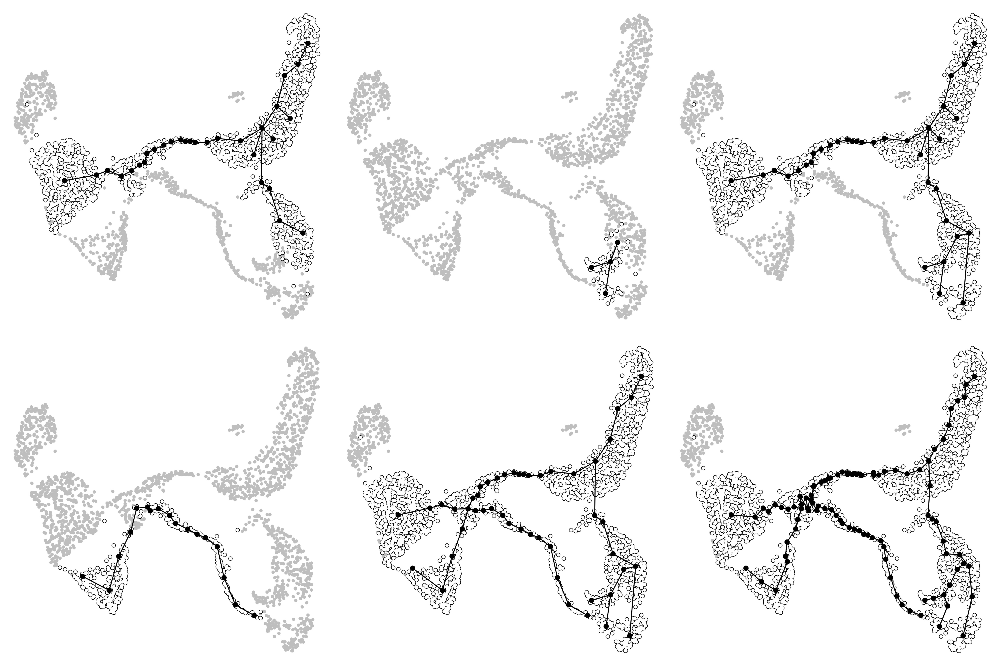

Saving elpigraph tree as crestree ppt object
--------------------------------------------

``` r
z_el=graph.to.ppt(NodePositions,Edges,X_a,umap)
plotppt(z_el,umap,tips=T)
z_el=set2roots(z_el,roots = c(2,47))

ppt=project.cells.onto.ppt(z_el,umap)
oldcol=ppt$pp.segments$color
#newcol=ggthemes::stata_pal("s2color")(15)[1:10]
newcol=RColorBrewer::brewer.pal(length(ppt$pp.segments$color)+2,"Set3")[-9]
names(newcol)=oldcol

for (c in oldcol){
  ppt$cell.summary$color[ppt$cell.summary$color==c]=newcol[c]
  ppt$cell.info[[1]]$color[ppt$cell.info[[1]]$color==c]=newcol[c]
  ppt$pp.segments$color[ppt$pp.segments$color==c]=newcol[c]
  ppt$pp.info$color[ppt$pp.info$color==c]=newcol[c]
}

## converting to dyno object for better visualisations
dyn=ppt.to.dyno(ppt,umap[rownames(ppt$cell.summary),],X = X_a)
dyn$milestone_network[1,1:2]=dyn$milestone_network[1,c(2,1)]

sz=1.5
pl_traj=plot_dimred(dyn,trajectory_projection_sd = .8,size_trajectory = sz)+theme(aspect.ratio = 1)+
  geom_point(data=data.frame(umap),aes(x=umap[,1],y=umap[,2]),color="grey")
pl_traj$layers[[5]]$geom_params$lineend="round"
pl_traj$layers[[4]]$aes_params$size=sz
pl_traj=gginnards::move_layers(pl_traj,idx = 7,position = "bottom")
pl_traj$data$color=ppt$cell.summary[pl_traj$data$cell_id,]$color

ggsave("figures/trajectory_overview.png",pl_traj,width = 7,height = 7,dpi = 300)
```

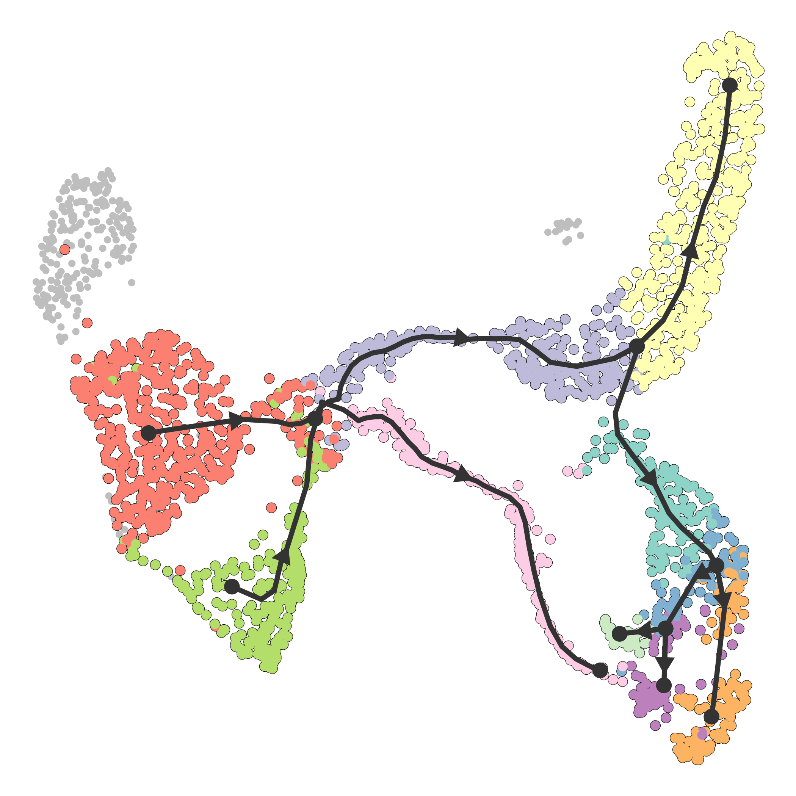

Pseudotime and bifurcation analysis using crestree
==================================================

Count matrix correction using scde
----------------------------------

``` r
counts=as.matrix(t(p2_sensory$misc$rawCounts))
mode(counts)<-"integer"
cdb <- gsub(":.*","",colnames(counts));
n.cores=10
min.cell.genes <- 3e3;min.cell.reads <- 1e3;min.gene.reads <- 10;
min.gene.cells <- 5;min.nonfailed <- 8;n.groups <- 10;trim <- 3;
res <- scde.process.dataset(counts,"sensory",batch=cdb,skip.pca = T)

fpm <- log10(exp(scde::scde.expression.magnitude(res$knn, res$cd))+1)
```

Finding and fitting genes associated with whole pseudotime tree
---------------------------------------------------------------

``` r
ppt <- test.associated.genes(ppt,n.map=1,fpm,summary=TRUE,n.cores = 20,A.cut = 1)
ppt <- fit.associated.genes(ppt,fpm,n.map=1,n.cores = 20,gamma = 5)

png("figures/stat.association.png",width = 7,height = 7,units = "in",res = 600)
par(mfrow=c(1,1),mar=c(4.5,4.5,1,1))
plot(ppt$stat.association$A,ppt$stat.association$fdr,xlab="Amplitude",ylab="FDR, log",log="y",pch=19,cex=0.5,
     col=adjustcolor( ifelse(ppt$stat.association$sign==TRUE,"red","black") ,0.4),cex.lab=1.5)
legend("bottomleft", legend=c( paste("DE,",sum(ppt$stat.association$sign)), paste("non-DE,",sum(!ppt$stat.association$sign))),
       col=c("red", "black"), bty="n",pch=19,cex=1,pt.cex=1)
dev.off()
```

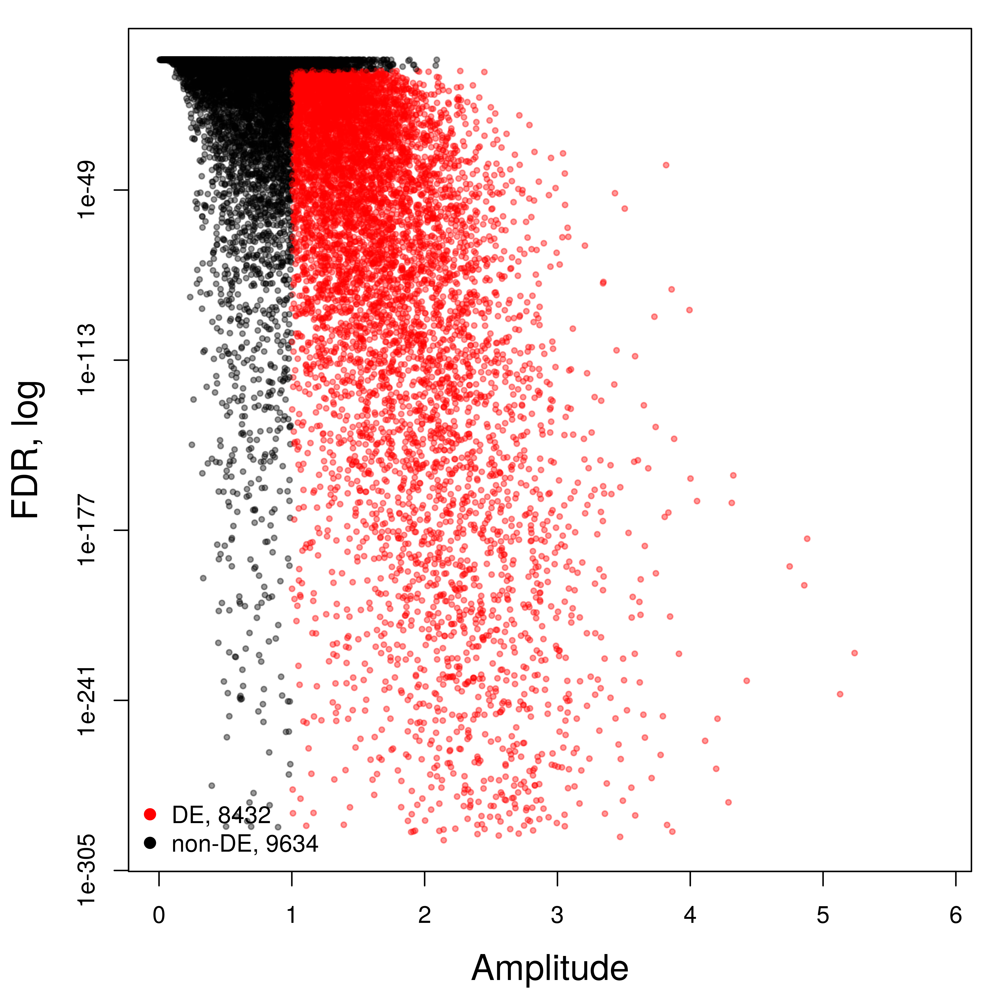

Plotting known markers
----------------------

``` r
zseg <- extract.subtree(ppt,c(2,4,29,28,32))
png("figures/markers_1.png",  width = 12, height = 8, units = 'in', res = 600)
par(mfrow=c(2,3))
for (g in c("Ntrk1","Ntrk2","Ntrk3","Runx3","Ret")){
  visualise.trajectory(ppt,g,fpm[g,],cex.main = 2,lwd.t2=0.5,subtree=zseg)
}
dev.off()
```

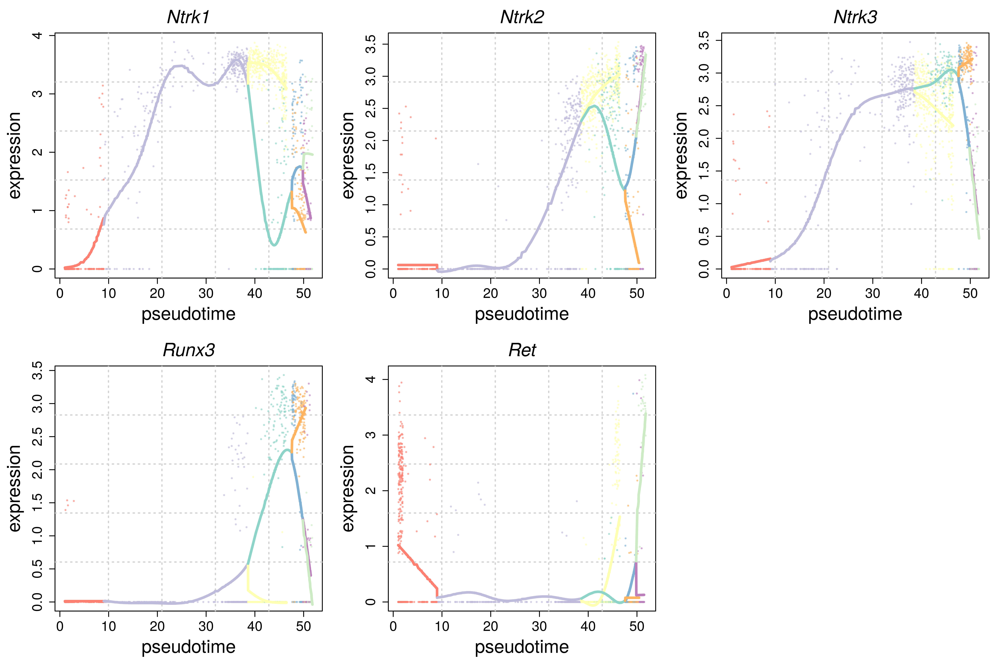

``` r
zseg <- extract.subtree(ppt,c(47,48))
png("figures/markers_2.png",  width = 12, height = 4, units = 'in', res = 600)
par(mfrow=c(1,3))
for (g in c("Ntrk1","Runx1","Runx3")){
  visualise.trajectory(ppt,g,fpm[g,],cex.main = 2,lwd.t2=0.5,subtree = zseg)
}
dev.off()
```

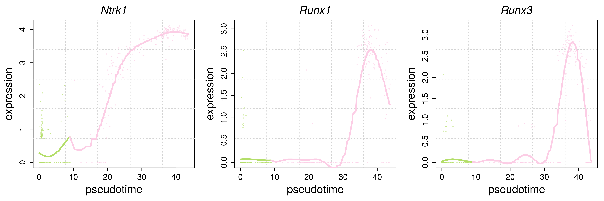

Neurogenic waves analysis
-------------------------

### Taking the two neurogenic waves separately, extracting common pseudotime genes

``` r
TFs=readLines("data/GO_TF_0140110.txt")
genes.tree=rownames(ppt$fit.summary)
subtree_e=extract.subtree(ppt,c(18,1))   #-infomap6
subtree_l=extract.subtree(ppt,c(18,48))  #-infomap8


res_e=test.associated.genes(ppt,fpm,subtree = subtree_e,n.cores = 20,verbose = T)
res_l=test.associated.genes(ppt,fpm,subtree = subtree_l,n.cores = 20,verbose = T)


genes_e=intersect(genes.tree,rownames(res_e[res_e$sign,]))
genes_l=intersect(genes.tree,rownames(res_l[res_l$sign,]))
common=intersect(genes_e,genes_l)

subtree=extract.subtree(ppt,c(18,1,48))
dst.cor <- 1 - cor(t(ppt$fit.summary[common,rownames(ppt$cell.summary[ppt$cell.summary$seg%in%subtree$seg,])]))
hclust.cor <- hclust(as.dist(dst.cor), method = "ward.D")
clust <- cutree(hclust.cor,2)
clust=clust[clust==2]
clust[clust==2]=1

common_early=names(clust)

png("figures/waves_common.png",width = 2800,height =1200,units = "px",res = 600,type = "cairo-png")
visualise.clusters(ppt,umap,clust,cex.gene=1,cex.cell=.5,cex.tree=1,n.best = 10,subtree=subtree)
dev.off()
```

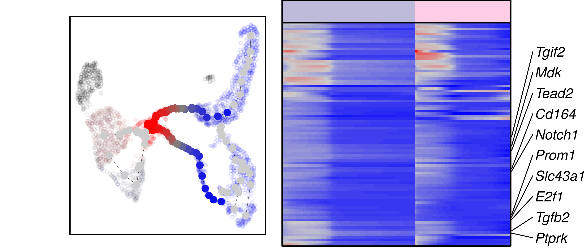

``` r
clust=clust[intersect(names(clust),TFs)]
png("figures/waves_common_TF.png",width = 2800,height =1200,units = "px",res = 600,type = "cairo-png")
visualise.clusters(ppt,umap,clust,cex.gene=1,cex.cell=.5,cex.tree=1,n.best = 10,subtree=subtree)
dev.off()
```

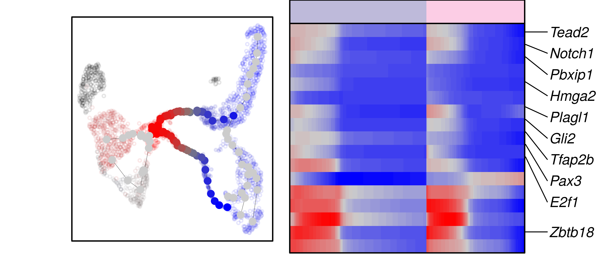

### Extracting wave specifc genes

#### Wave A

``` r
# A specific
genes_e_spe=setdiff(genes_e,common)
dst.cor <- 1 - cor(t(ppt$fit.summary[genes_e_spe,
                                        rownames(ppt$cell.summary[ppt$cell.summary$seg%in%subtree_e$seg,])]))
hclust.cor <- hclust(as.dist(dst.cor), method = "ward.D")
clust <- cutree(hclust.cor,2)
clust=clust[clust==2]
clust[clust==2]=1

early_spe=names(clust)

png("figures/wave_A_spe.png",width = 3000,height =1200,units = "px",res = 600,type = "cairo-png")
visualise.clusters(ppt,umap,clust,cex.gene=1,cex.cell=.5,cex.tree=1,n.best = 10,subtree=subtree_e)
dev.off()
```

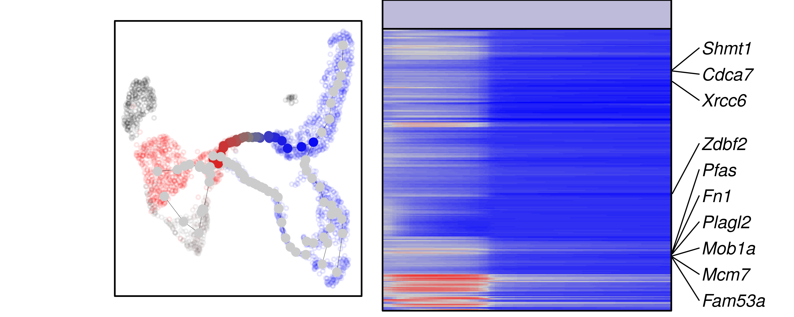

``` r
clust=clust[intersect(names(clust),TFs)]
png("figures/wave_A_spe_TF.png",width = 3000,height =1200,units = "px",res = 600,type = "cairo-png")
visualise.clusters(ppt,umap,clust,cex.gene=1,cex.cell=.5,cex.tree=1,n.best = 10,subtree=subtree_e)
dev.off()
```


#### Wave B

``` r
genes_l_spe=setdiff(genes_l,common)
dst.cor <- 1 - cor(t(ppt$fit.summary[genes_l_spe,
                                        rownames(ppt$cell.summary[ppt$cell.summary$seg%in%subtree_l$seg,])]))
hclust.cor <- hclust(as.dist(dst.cor), method = "ward.D")
clust <- cutree(hclust.cor,2)
clust=clust[clust==2]
clust[clust==2]=1

late_spe=names(clust)

png("figures/wave_B_spe.png",width = 3000,height =1200,units = "px",res = 600,type = "cairo-png")
visualise.clusters(ppt,umap,clust,cex.gene=1,cex.cell=.5,cex.tree=1,n.best = 10,subtree=subtree_l)
dev.off()
```


``` r
clust=clust[intersect(names(clust),TFs)]
png("figures/wave_B_spe_TF.png",width = 3000,height =1200,units = "px",res = 600,type = "cairo-png")
visualise.clusters(ppt,umap,clust,cex.gene=1,cex.cell=.5,cex.tree=1,n.best = 10,subtree=subtree_l)
dev.off()
```

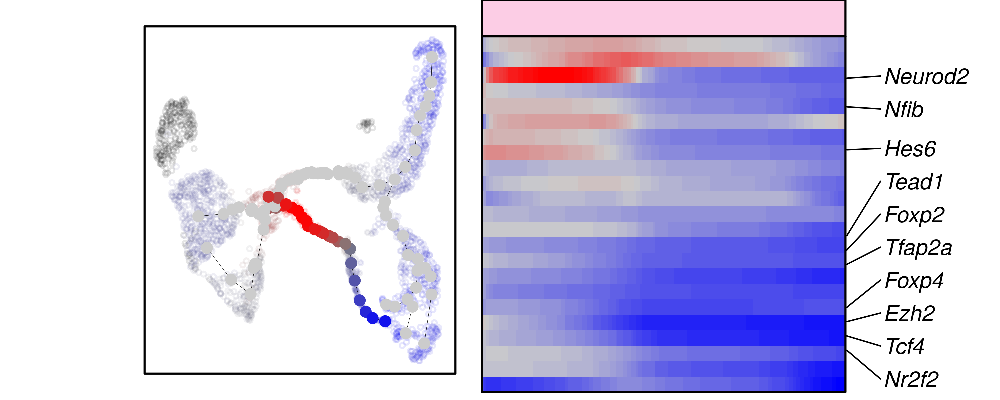

TF Activity inference
---------------------

``` r
motmat=readRDS("data/motmat.rds")

crmotmat = cor(motmat)
hc = hclust( as.dist( (1-crmotmat)^3 ),method="ward"  )
tfclust = cutree(hc, k = 7);
png("figures/tfcormat.png",width = 3000,height =3000)
heatmap( crmotmat ,
         col=colorRampPalette(c("blue","lightgrey", "red"))(n = 200),
         Rowv=as.dendrogram(hc),labCol=FALSE,Colv=as.dendrogram(hc),cexRow=0.8,scale="none",
         RowSideColors=as.character(tfclust))

dev.off()
```

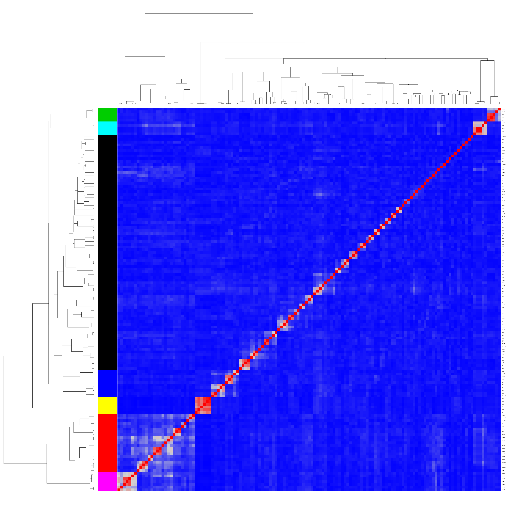

``` r
genes.incl = names(tfclust[!(tfclust%in%c(2,7,5,3))])
act = activity.lasso(ppt$fit.summary,motmat[,genes.incl],n.cores = 10)

tfs=intersect(rownames(act),genes.tree)

cor_act=sapply(tfs,function(t) cor(ppt$fit.summary[t,],act[t,]))


sometf=c("Sox2","Crem","Gli2","Nfia","Meis2","Tfap2a","Neurod1","Neurod2","Sox5")

png("figures/tf_act.png",width = 4,height =18,units = "in",res=600)
par(mfrow=c(9,2))
for (tf in sometf){
  par(mar=c(1,1,1,1))
  plotppt(ppt,umap,pattern.cell = ppt$fit.summary[tf,],gene=tf,cex.main=0.5,cex.tree = 1,lwd.tree = 0.1,par=FALSE)
  par(mar=c(1,1,1,1))
  plotppt(ppt,umap,pattern.cell = act[tf,],gene=tf,cex.main=0.5,cex.tree = 1,lwd.tree = 0.1,par=FALSE,pallete = colorRampPalette(c("darkgreen","gray50","orange")) )
}
dev.off()
```


Bifurcation analysis
--------------------

### Bifurcation A

``` r
root <- 18
leaves <- c(28,32)
subtree <- extract.subtree(ppt,c(root,leaves))

pl=plot.tree(ppt,dyn,umap,subtree)
ggsave(paste0("figures/Mechano_Proprio_subtree.png"),pl,width = 50,height = 50,units = "mm",dpi = 600,scale = 3)
```

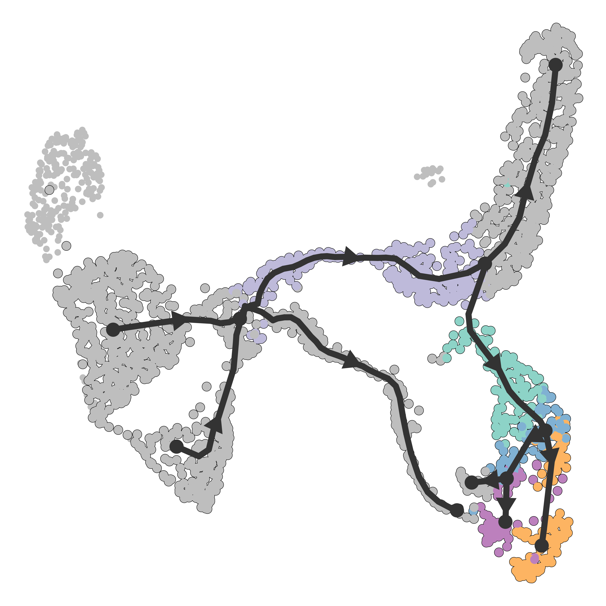

``` r
fork.de <- test.fork.genes(ppt,fpm,root=root,leaves=leaves,n.cores = 20)
fork.de.temp = fork.de
fork.de = fork.de.temp

fork.de <- branch.specific.genes(fork.de,effect.b1 = 0.4,effect.b2 = 0.6)

genes.1 <- intersect(rownames(fork.de)[fork.de$state==1],genes.tree)
genes.2 <- intersect(rownames(fork.de)[fork.de$state==2],genes.tree)

fork.de.act <- activation.fork(ppt,fork.de,fpm,root,leaves,deriv.cutoff = 0.015, n.cores = 1)


fork.pt(ppt,root,leaves)
cutoff <- 46

genes.1.late <- genes.1[fork.de.act[genes.1,]$activation > cutoff]
genes.1.early <- setdiff(genes.1,genes.1.late)

genes.2.late <- genes.2[fork.de.act[genes.2,]$activation > cutoff]
genes.2.early <- setdiff(genes.2,genes.2.late)

root <- 18
leaves <- c(28,32)
subtree <- extract.subtree(ppt,c(root,leaves))

cells <- rownames(ppt$cell.summary)[ppt$cell.summary$seg %in% extract.subtree(ppt,c(root,leaves))$segs]

programs=data.frame(`late 1`=colMeans(fpm[genes.1.late,cells]),
                    `early 1`=colMeans(fpm[genes.1.early,cells]),
                    `late 2`=colMeans(fpm[genes.2.late,cells]),
                    `early 2`=colMeans(fpm[genes.2.early,cells]))

pl.1=ggplot(programs)+geom_point(aes(x=early.1,y=early.2),col=ppt$cell.summary[cells,]$color)+
  theme_classic()+theme(panel.border = element_rect(colour = "black", fill=NA),aspect.ratio = 1)+
  xlab("early Mechano TrkB")+ylab("early Proprio")
pl.2=ggplot(programs)+geom_point(aes(x=late.1,y=late.2),col=ppt$cell.summary[cells,]$color)+
  theme_classic()+theme(panel.border = element_rect(colour = "black", fill=NA),aspect.ratio = 1)+
  xlab("late Mechano TrkB")+ylab("late Proprio")

ggsave(paste0("figures/Mechano_Proprio_bifurcation.png"),arrangeGrob(pl.1,pl.2,nrow = 1),width = 60,height = 30,units = "mm",dpi = 600,scale = 3)
```

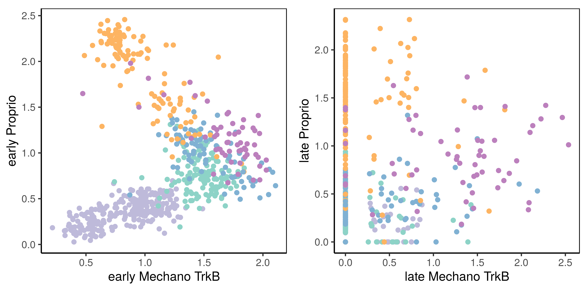

``` r
fork.de.act.1=fork.de.act[genes.1.early,-c(4,5,10)]
fork.de.act.1=rbind(fork.de.act.1,fork.de.act[genes.1.late,-c(4,5,10)])
fork.de.act.1$activation.cat="early"
fork.de.act.1[genes.1.late,]$activation.cat="late"
fork.de.act.1$relation = "Mechano"

ordered.1.early=fork.de.act.1[fork.de.act.1$activation.cat%in%"early",]
ordered.1.early=rownames(ordered.1.early)[order(ordered.1.early$effect,decreasing = T)]
ordered.1.early_tf=ordered.1.early[ordered.1.early%in%TFs]
ordered.1.late=fork.de.act.1[fork.de.act.1$activation.cat%in%"late",]
ordered.1.late=rownames(ordered.1.late)[order(ordered.1.late$effect,decreasing = T)]


fork.de.act.2=fork.de.act[genes.2.early,-c(4,5,10)]
fork.de.act.2=rbind(fork.de.act.2,fork.de.act[genes.2.late,-c(4,5,10)])
fork.de.act.2$activation.cat="early"
fork.de.act.2[genes.2.late,]$activation.cat="late"
fork.de.act.2$relation = "PSNs"

ordered.2.early=fork.de.act.2[fork.de.act.2$activation.cat%in%"early",]
ordered.2.early=rownames(ordered.2.early)[order(ordered.2.early$effect,decreasing = F)]
ordered.2.early_tf=ordered.2.early[ordered.2.early%in%TFs]
ordered.2.late=fork.de.act.2[fork.de.act.2$activation.cat%in%"late",]
ordered.2.late=rownames(ordered.2.late)[order(ordered.2.late$effect,decreasing = F)]


early=c(genes.1.early,genes.2.early);early[early%in%genes.1.early]=1;early[early%in%genes.2.early]=2
early=as.numeric(early);names(early)=c(genes.1.early,genes.2.early)

genes.show=early[c(ordered.1.early[1:ifelse(length(genes.1.early)<10,length(genes.1.early),10)],
                  ordered.2.early[1:ifelse(length(genes.2.early)<10,length(genes.2.early),10)])]
png("figures/Mechano_Proprio_early.png",width = 2800,height =1700,units = "px",res = 600)
visualise.clusters(ppt,umap,early,cex.gene=1,cex.cell=.5,cex.tree=1,n.best = 10,subtree = subtree,genes.show = genes.show)
dev.off()
```

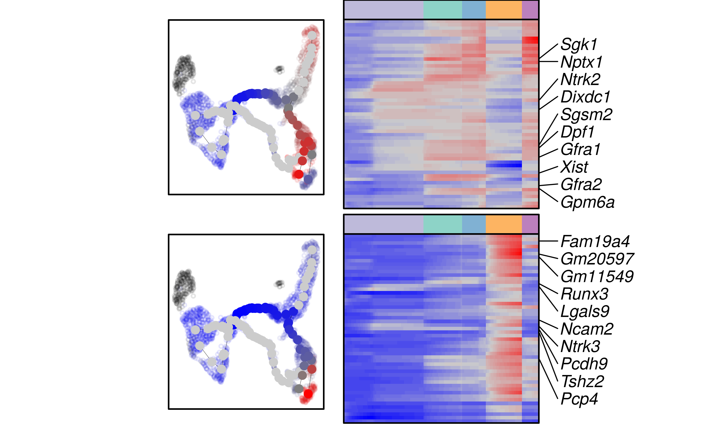

``` r
early_tf=early[names(early)%in%TFs]

png("figures/Mechano_Proprio_early_TF.png",width = 2800,height =1700,units = "px",res = 600)
visualise.clusters(ppt,umap,early_tf,cex.gene=1,cex.cell=.5,cex.tree=1,n.best = 10,subtree = subtree)
dev.off()
```

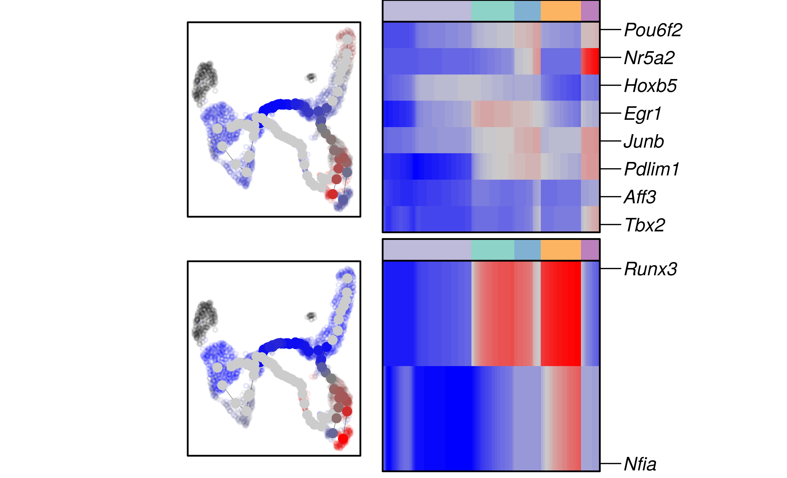

``` r
late=c(genes.1.late,genes.2.late);late[late%in%genes.1.late]=1;late[late%in%genes.2.late]=2
late=as.numeric(late);names(late)=c(genes.1.late,genes.2.late)

genes.show=late[c(ordered.1.late[1:ifelse(length(genes.1.late)<10,length(genes.1.late),10)],
                  ordered.2.late[1:ifelse(length(genes.2.late)<10,length(genes.2.late),10)])]
png("figures/Mechano_Proprio_late.png",width = 2800,height =1700,units = "px",res = 600)
visualise.clusters(ppt,umap,late,cex.gene=1,cex.cell=.5,cex.tree=1,n.best = 20,subtree = subtree,genes.show = genes.show)
dev.off()
```

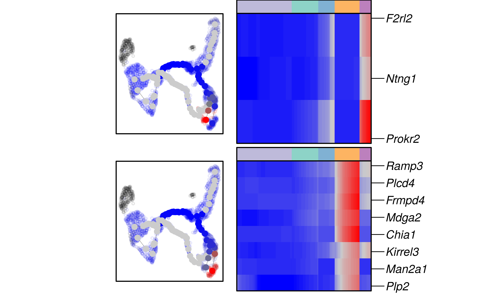

``` r
regions = list(list(4,483,1,1),list(3,161,240,1),list(3,1,160,1),list(1,139,1,1),
               list(5,1,80,1),list(6,121,1,1),list(9,57,1,1),list(10,32,1,1))
freq <- slide.cells(ppt,root,leaves,wind=30,regions = regions)


cors <- slide.cors(freq,fpm,genes.1.early,genes.2.early)
fig_cells <- fig.cells(umap,freq)
fig_cor <- fig.cors(cors,genes.1.early,genes.2.early)
#marrangeGrob( c(fig_cells,fig_cor),ncol=length(fig_cells),nrow=2,
#              layout_matrix = matrix(seq_len(2*length(fig_cells)), nrow = 2, ncol = length(fig_cells),byrow=TRUE),top=NA)


corA <- cors[[5]][,1]
genesetA <- names(which(corA[genes.1.early] > 0.05))

corB <- cors[[5]][,2]
genesetB <- names(which(corB[genes.2.early] > 0.05))
cors <- slide.cors(freq,fpm,genesetA,genesetB)
fig_cor_B <- fig.cors(cors,genesetA,genesetB,val = T,
                       c1=ppt_el$pp.segments$color[ppt_el$pp.segments$to==28],
                       c2=ppt_el$pp.segments$color[ppt_el$pp.segments$to==32])

png("figures/Mechano_Proprio_Sliding.png",width = 1.5*length(cors),height = 3,res = 300,units = "in")
fig_cor <- fig.cors(cors,genesetA,genesetB)
marrangeGrob( c(fig_cells,fig_cor),ncol=length(fig_cells),nrow=2,
              layout_matrix = matrix(seq_len(2*length(fig_cells)), nrow = 2, ncol = length(fig_cells),byrow=TRUE),top=NA)
dev.off()
```

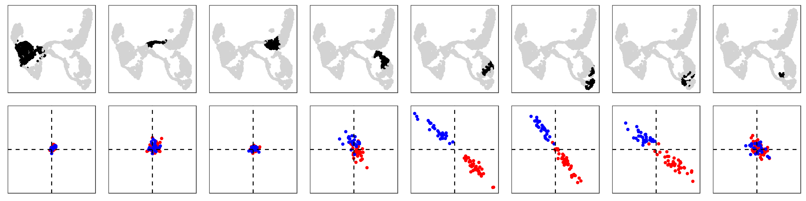

``` r
w=50
step=10
crd <- synchro(ppt,fpm,root,leaves,genesetA,genesetB,w,step,n.mapping=1,n.points = 300,span.smooth = 0.1,perm=FALSE)
p_crd=visualize.synchro(crd,sc1=c(0,0.2),sc2=c(0,.2),sc3=c(-0.2,0.1),vert = fork.pt(ppt,root,leaves)["bifurcation"])

ggsave("figures/Mechano_Proprio_Syncho.png",
       p_crd,
       width = 7,height = 7,dpi = 600)
```

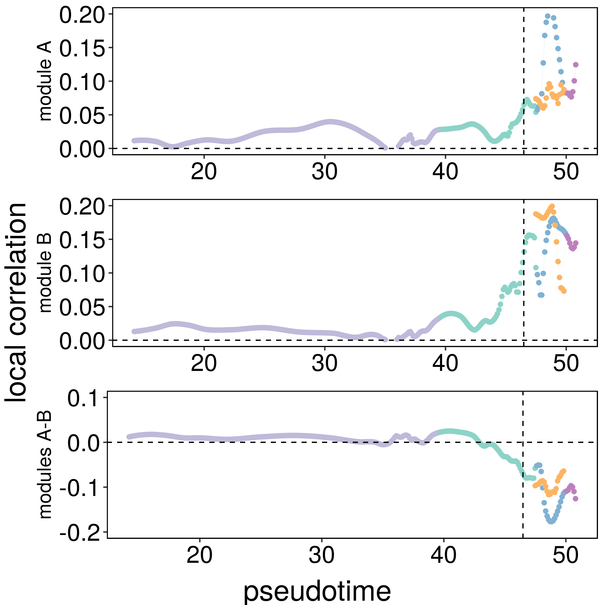
